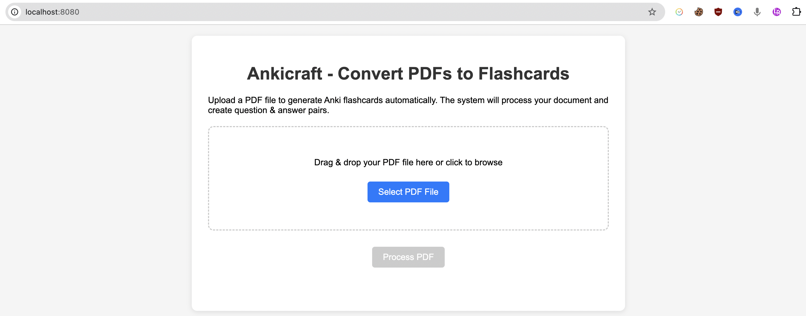

# Ankicraft



Ankicraft is an AI-powered tool that automatically generates flashcards from articles, research papers, or PDFs. It uses advanced language processing and AI to create effective flashcards for studying and memorization, supporting multiple languages.

## Features

- Automatically extract key information from various document formats
- AI-powered generation of question-and-answer flashcards
- Export to Anki-compatible format
- Multi-language support with automatic language detection
- Support for PDF, HTML, and text documents
- Web interface with drag and drop functionality
- Progress tracking and download capabilities

## Installation

1. Clone the repository:
```bash
git clone <repository-url>
cd ankicraft
```

2. Install dependencies using uv:
```bash
uv sync
```

## Usage

### Command Line Interface

To run Ankicraft from the command line:

```bash
uv run python -m ankicraft.flashcard_generator --input <input_file_or_url> --output <output_directory>
```

### Web Interface

To start the web server:

```bash
uv run python -m ankicraft
```

By default, the server will run on `http://0.0.0.0:8080`. You can configure the host and port using environment variables:

```bash
WEB_HOST=0.0.0.0
WEB_PORT=8080
WEB_DEBUG=False
```

The web interface provides:
- Drag and drop file upload
- Progress tracking
- Download of generated Anki decks

### Docker Deployment

To run Ankicraft using Docker Compose:

```bash
docker-compose up --build
```

The service will be available at `http://localhost:8080`.

To run in detached mode:

```bash
docker-compose up --build -d
```

To stop the service:

```bash
docker-compose down
```

### API Usage

You can also use the API endpoints directly:

- `POST /api/upload` - Upload a PDF file for processing
- `GET /api/status/{file_id}` - Check processing status
- `GET /api/download/{file_id}` - Download the processed file

## Configuration

Ankicraft uses a `.env` file for configuration. Copy `.env.example` to `.env` and modify as needed:

```bash
cp .env.example .env
```

Available configuration options:

- `WEB_HOST`: Host for the web server (default: 0.0.0.0)
- `WEB_PORT`: Port for the web server (default: 8080)
- `WEB_DEBUG`: Enable debug mode (default: False)
- `DEFAULT_FLASHCARD_COUNT`: Number of flashcards to generate (default: 20)
- `DEFAULT_DECK_NAME`: Default name for generated Anki decks
- `AI_PROVIDER`: AI provider to use (transformers, openai) (default: transformers)
- `OPENAI_API_KEY`: API key for OpenAI (if using OpenAI)
- `OPENAI_MODEL`: OpenAI model to use (default: gpt-4o-mini)
